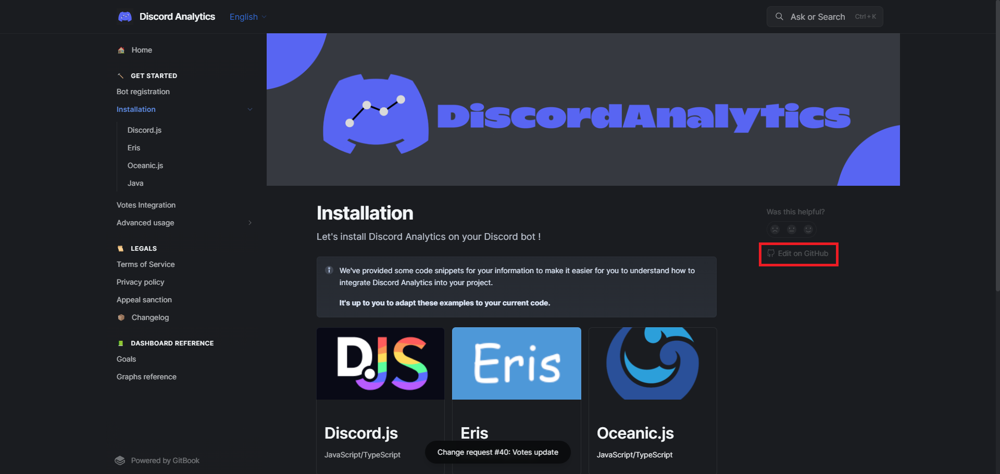

# 🏠 Accueil

## Présentation du service

Discord Analytics est L'OUTIL pour tous les développeurs de bots Discord. Notre service leur permett d'accéder à une grande quantité de statistiques à propos de leur bot. Le tout en temps réel et dans un tableau de bord intuitif.

Le service est en constante évolution. Actuellement, nous offrons une large gamme de graphique à propos des interactions, serveurs, utilisateurs, et même les langues !

Compatible avec bon nombre de librairies et languages, vous n'aurez aucune excuse pour passer à côté !

***

## Présentation de la documentation

Dans cette documentation, vous retrouverez :

* Un guide d'installation complet pour chacun des librairies compatibles
* Des tutoriels
* La liste de tous les graphiques et objectifs
* Tous les changelogs
* Les mentions légales (Conditions d'Utilisation/olitique de Confidentialité)
* Et bien plus...

***

## Contribuer

Vous pouvez contribuer à cette documentation en cliquant sur le bouton "Edit on GitHub".

<figure><figcaption>
"Edit on GitHub" button location
</figcaption></figure>

Ou directement depuis le dépôt suivant :&#x20;



## Liens utiles

* Site Web : [https://discordanalytics.xyz](https://discordanalytics.xyz)
* Documentation : [https://docs.discordanalytics.xyz](https://docs.discordanalytics.xyz)
  * Démarrer : [https://docs.discordanalytics.xyz/get-started](broken-reference/)
  * Conditions d'Utilisation : [https://discordanalytics.xyz/go/terms](broken-reference)
  * Politique de Confidentialité : [https://docs.discordanalytics.xyz/legals/privacy-policy](broken-reference)
* Statut des services: [https://status.discordanalytics.xyz](https://status.discordanalytics.xyz)

***

* Paquet NPM : [https://www.npmjs.com/package/discord-analytics](https://www.npmjs.com/package/discord-analytics)
* Paquet Maven : [https://github.com/DiscordAnalytics/java-package/packages/1839795](https://github.com/DiscordAnalytics/java-package/packages/1839795)
* Paquet PyPI : [https://pypi.org/project/discordanalytics/](https://pypi.org/project/discordanalytics/)
