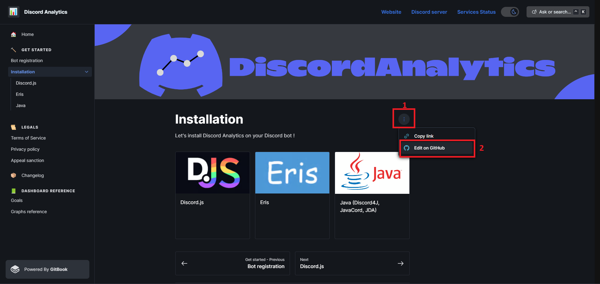

# 🏠 Home

## Service Overview

Discord Analytics is THE tool for all Discord bot developers. Our service allows you to access numerous statistics about your bot. All in real-time and on an intuitive dashboard.

The service is constantly evolving. Currently, we offer a wide range of charts on interactions, servers, users, and even languages!

Compatible with a wide range of languages and libraries, you'll have no excuse to pass it by!

***

## Docs Overview

In this documentation, you will find:

* A complete installation guide for each of the libraries
* Tutorials
* List of all graphs and goals
* Complete changelogs
* Legal texts (Terms of Service/Privacy Policy)
* And much more...

***

## Contribute

You can contribute to improving this documentation by clicking the "Edit on GitHub" button.

<figure><figcaption>
"Edit on GitHub" button location
</figcaption></figure>

Or directly from the repository located just below:



## Useful links

* Website: [https://discordanalytics.xyz](https://discordanalytics.xyz)
* Documentation : [https://docs.discordanalytics.xyz](https://docs.discordanalytics.xyz)
  * Get started: [https://docs.discordanalytics.xyz/get-started](broken-reference)
  * Terms of Service: [https://discordanalytics.xyz/go/terms](legals/terms.md)
  * Privacy Policy: [https://docs.discordanalytics.xyz/legals/privacy-policy](legals/privacy-policy.md)
* Services Status: [https://status.discordanalytics.xyz](https://status.discordanalytics.xyz)

***

* NPM package: [https://www.npmjs.com/package/discord-analytics](https://www.npmjs.com/package/discord-analytics)
* Maven package: [https://github.com/DiscordAnalytics/java-package/packages/1839795](https://github.com/DiscordAnalytics/java-package/packages/1839795)
