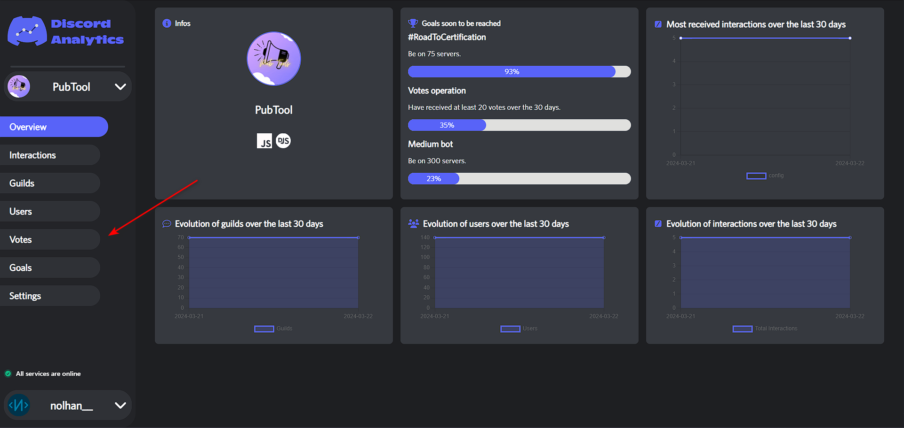
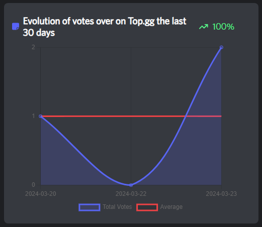
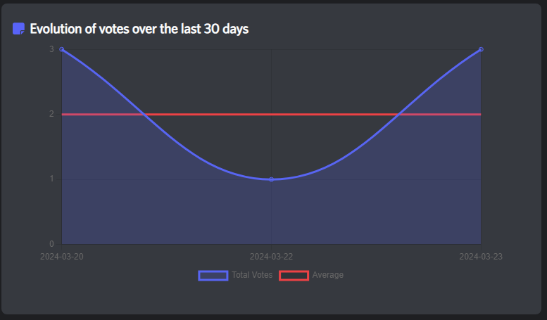
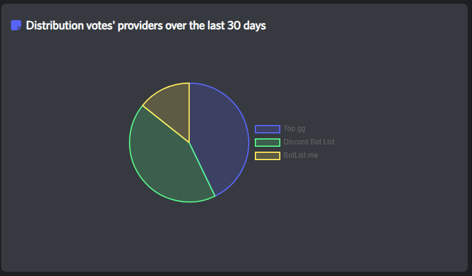
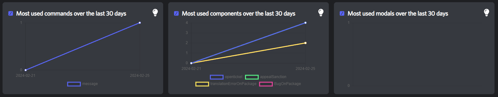
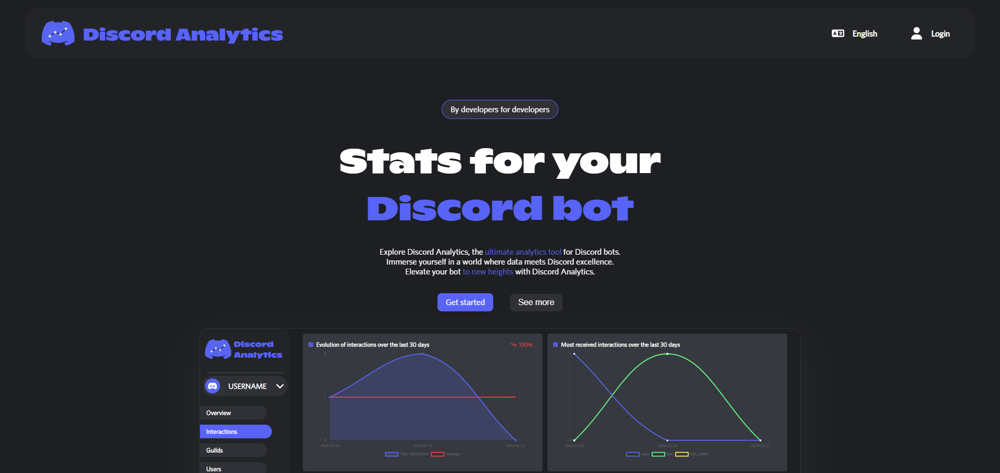
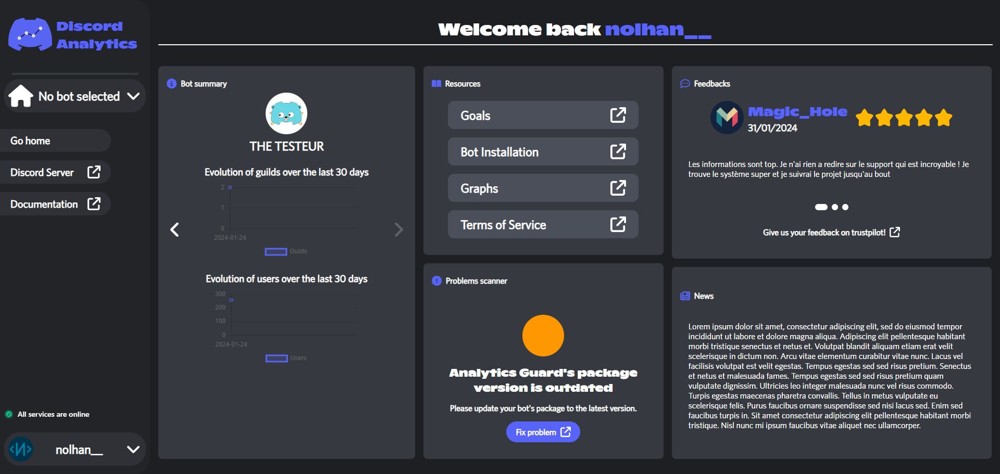
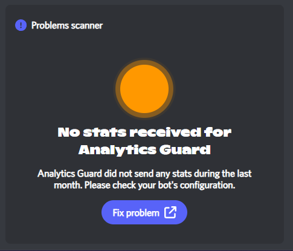
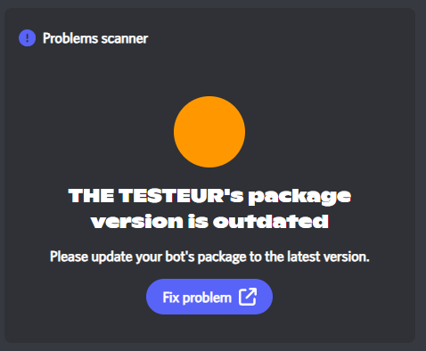
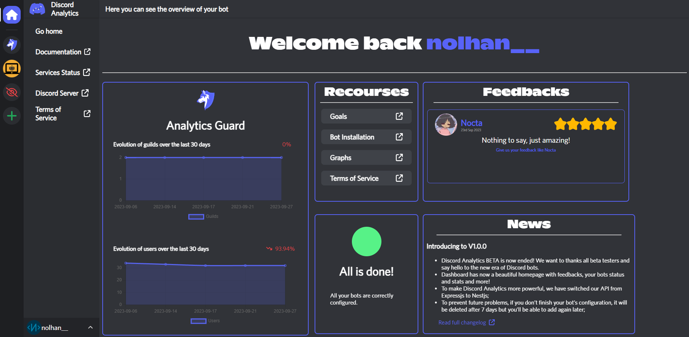

# 📦 Changelog

## XX/03/2024

* As you requested, we have integrated a new category of statistics: votes

<figure><figcaption></figcaption></figure>

* We have added 3 graphs in this category. Check [Graphs reference](dash-reference/graphs-reference.md#votes) for more informations

<figure><figcaption></figcaption></figure>

 

<figure><figcaption></figcaption></figure>

 

<figure><figcaption></figcaption></figure>

* In line with this new category, we have added a new objective: **Votes Operation**
* We have restructured our infrastructure to make it more scalable in the future.

## 27/02/2024

* We have added three new graphs about interactions:

<figure><figcaption></figcaption></figure>

* We have added some tooltips to help people who don't read the docs 😏

## 23/02/2024

* We have updated the design of our website :&#x20;

<figure><figcaption></figcaption></figure>

 

<figure><figcaption></figcaption></figure>

* We gave added a new graph about guilds' size ! More information [here](dash-reference/graphs-reference.md#distribution-of-guilds-by-size)
* Discord Analytics is now compatible with [Oceanic.js](https://oceanic.ws/)
* API has been reworked to make development easier.&#x20;
* NodeJS packages have been updated to allow you to save performances by creating the events yourself. More information [here](get-started/advanced-usage/optimize-events.md) (Advanced users only)
* Give access your teammates to your bot's stats by following our [new tutorial](get-started/advanced-usage/teams.md)
* The problems scanner have been updated to warn you about more problems

<figure><figcaption></figcaption></figure>

 

<figure><figcaption></figcaption></figure>

* To make it easier for you to communicate with support, we have added an option to send us all the information we need to help you solve your problem. When you are on the Dashboard, click on the logo three times.
* Removed lotties on the home page to make it faster and conserve CPU/GPU resources
* Linked Roles have been patched
* Documentation is now fully completed

## 30/09/2023

* Discord Analytics BETA is now ended! We want to thank all beta testers and say hello to the new era of Discord bots;
* Dashboard has now a beautiful homepage with feedback, your bots status, stats, and more;

<figure><figcaption>
New dashboard's homepage
</figcaption></figure>

* To prevent future problems, if you don't finish your bot's configuration, it will be deleted after 7 days. You'll be able to add it again;
* We have reworked all graphs and added news :&#x20;

* We have patched a duplication: you might see that on your guilds' locales graph, there were too many guilds compared to the real count.&#x20;


You will see a big decrease in your stats. We are sorry for that.


* We have removed the Spanish translation.
* All banned bots and accounts have been unbanned because BETA is finished!
