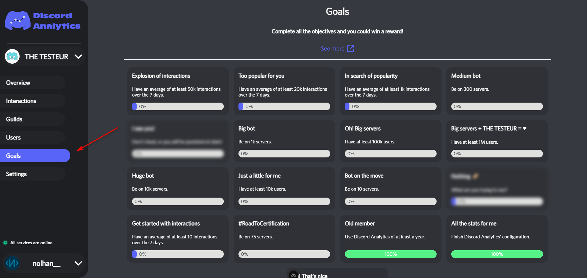

# Goals

On Discord Analytics, you can find a list of goals to make the adventure of your bot funnier !

<figure><figcaption>
Goals page location
</figcaption></figure>


Please note that all this goals are based on your bot's current stats and that you may well lose some of them overnight!


## Guilds goals

To complete these goals, you must have a certain number of guilds.


These goals are based on the day's stats and are precise.


| Goal title           | Required guilds count | Difficulty |
| -------------------- | --------------------- | ---------- |
| Bot on the move      | 10                    | easy       |
| #RoadToCertification | 75                    | easy       |
| Medium bot           | 300                   | medium     |
| Big bot              | 1'000                 | hard       |
| Huge bot             | 10'000                | very hard  |

### Users goals

These goals require you to have a certain number of users.


These goals are based on the day's stats and are not precise because the stats used add up the number of members of each guild (which can lead to duplication).


<table><thead><tr><th width="231.33333333333331">Goal title</th><th>Required users count</th><th>Diffuculty</th></tr></thead><tbody><tr><td>Just a little for me</td><td>10'000</td><td>easy</td></tr><tr><td>Oh! Big servers</td><td>100'000</td><td>medium</td></tr><tr><td>Big servers + BOT = ♥</td><td>1'000'000</td><td>hard</td></tr></tbody></table>

### Seniority goals

Your bot must have been registered for some time to unlock these goals.

| Goal title      | Required time | Difficulty |
| --------------- | ------------- | ---------- |
| Oh! That's nice | 1 month       | easy       |
| Old member      | 12 month      | medium     |

### Interaction average goals

To complete these goals, your bot must have a certain average of interactions over the last week.

| Goal title                    | Required interactions count | Difficulty |
| ----------------------------- | --------------------------- | ---------- |
| Get started with interactions | 10                          | easy       |
| In search of popularity       | 1'000                       | medium     |
| Too popular for you           | 20'000                      | hard       |
| Explosion of interactions     | 50'000                      | very hard  |

### Other goals

These goals can't be classified in others categories.


Goals that are replaced by `???` are secret goals !


| Goal title            | Unlock conditions                        | Difficulty |
| --------------------- | ---------------------------------------- | ---------- |
| All the stats for me  | Enable tracking for all available stats. | easy       |
| ???                   | 🥖                                       | medium     |
| ???                   | ???                                      | hard       |
