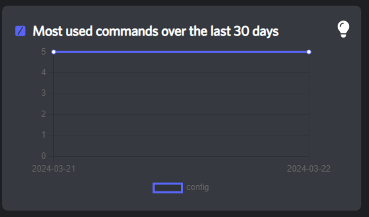
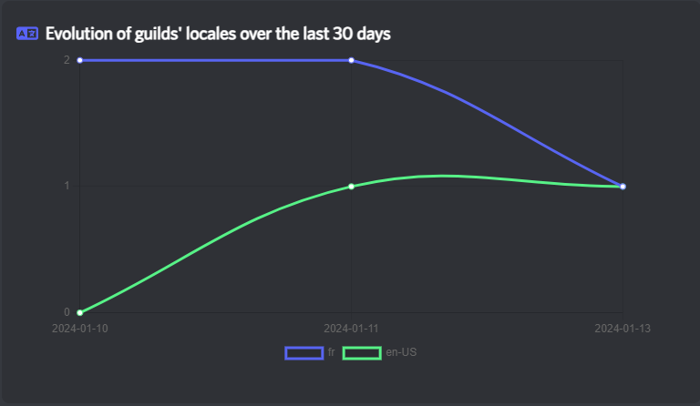
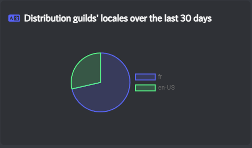
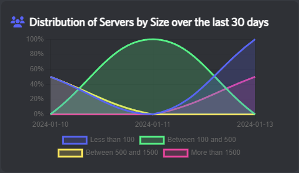
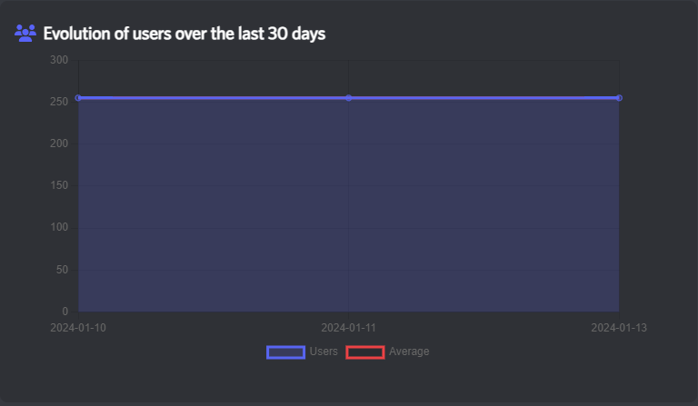
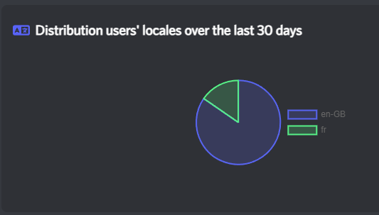
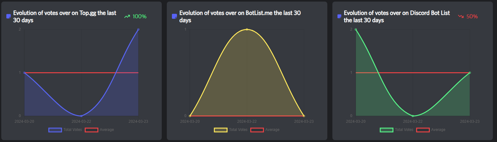

# Graphs reference

## Interactions

### Total evolution

<figure><figcaption></figcaption></figure>

This graph gave you information about the evolution of received interactions over the last 30 days. It uses all interaction types.


You can see the evolution (in percentage) compared to the previous month if not equal to zero.


### Most received evolution

<figure><figcaption></figcaption></figure>

This graph shows you the 5 most received interactions (all types combined) over the last 30 days.

To determine these 5 interactions, the website adds the last month's stats and picks the top 5.

### Most received per type

<figure><figcaption></figcaption></figure>

 

<figure><figcaption>
Line graphs version
</figcaption></figure>

These tree graphs show you the percentage of most received interactions, filtered per type (Commands, Components and Modals. To determine the 5 interactions, the website adds the last month's stats and picks the top 5.

***

## Guilds

### Total evolution

<figure><figcaption></figcaption></figure>

This graph gave you information about the evolution of guilds over the last 30 days.


You can see the evolution (in percentage) compared to the previous month if not equal to zero.


### Most used locales evolution

<figure><figcaption></figcaption></figure>

This graph allows you to see the evolution of the top 5 locales used by your bot's guilds.&#x20;

To determine these 5 locales, the website adds the statistics from the last month and selects the top 5.

### Most used locales pie

<figure><figcaption></figcaption></figure>

This pie chart allows you to see the percentage of your bot's guilds most used locales.

### Distribution of guilds by size

<figure><figcaption></figcaption></figure>

This graph allows you to see the size of the guilds that your bot is in as a percentage.

***

## Users


**All user stats are not accurate. It adds up all the members of all the guilds, so it can create duplicates, and it does not reflect the real active user count of your bot.**


### Total evolution

<figure><figcaption></figcaption></figure>

This graph gave you information about the evolution of users over the last 30 days.


You can see the evolution (in percentage) compared to the previous month if not equal to zero.


### Most used locales pie

<figure><figcaption></figcaption></figure>

This pie chart allows you to see the percentage of your bot's users most used locales.

## Votes

### Total evolution

<figure><figcaption></figcaption></figure>

This graph gave you information about the evolution of received votes over the last 30 days.It mixes the votes from all compatible voting providers.

### Distribution of votes providers

<figure><figcaption></figcaption></figure>

Determine which voting provider is most used by your users.

### Individual votes evolution

<figure><figcaption></figcaption></figure>

This are exactly the same graphs as [Total evolution](graphs-reference.md#total-evolution-3), but split between different votes providers.
