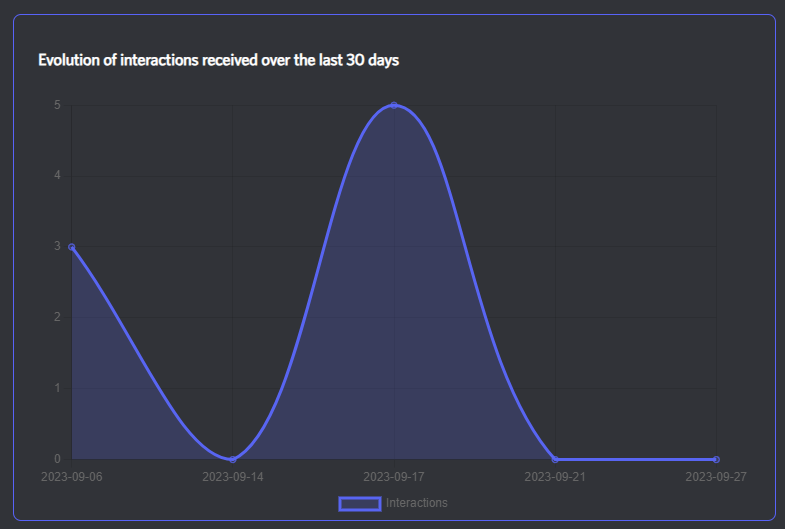
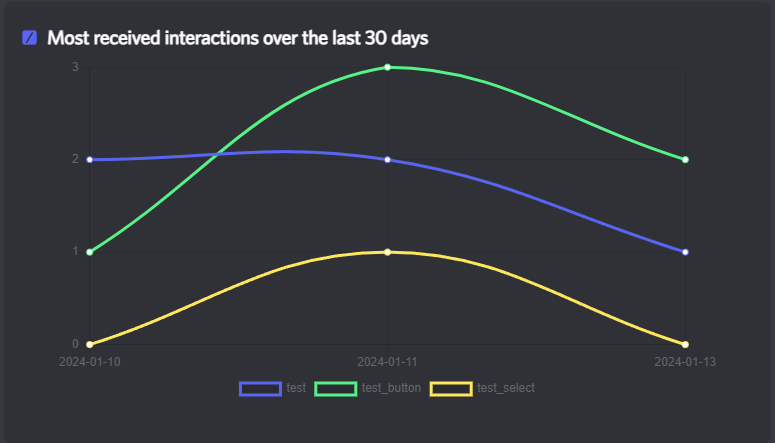
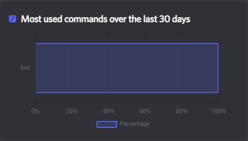
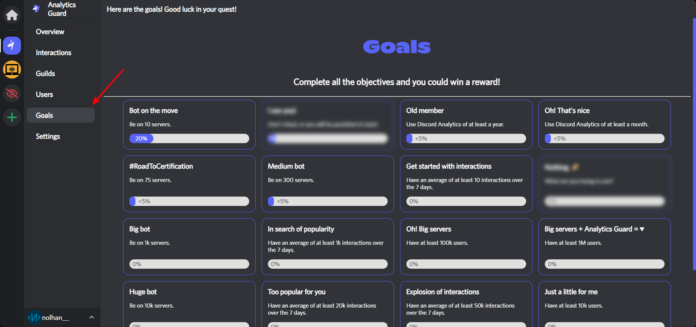

# Graphs reference

## Interactions

### Total evolution

<figure><figcaption></figcaption></figure>

This graph gave you information about the evolution of received interactions over the last 30 days. It uses all interaction types.

### Most received evolution

<figure><figcaption></figcaption></figure>

This graph shows you the 5 most received interactions (all types combined) over the last 30 days.

To determine the 5 interactions, the website adds the last month's stats and picks the top 5.

### Most received per type

<figure><figcaption></figcaption></figure>

These tree graphs show you the percentage of most received interactions, filtered per type (so, tree graphs). To determine the 5 interactions, the website adds the last month's stats and picks the top 5.

## Guilds

### Total evolution

<figure><figcaption></figcaption></figure>

This graph gave you information about the evolution of guilds over the last 30 days. It uses all interaction types.


You can see the evolution (in percentage) compared to the previous month if not equal to zero.



The rest is coming soon!

