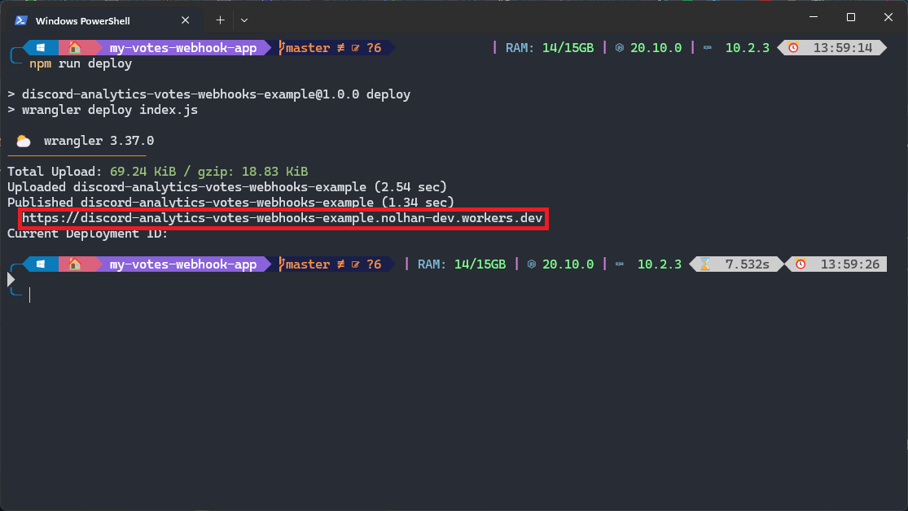
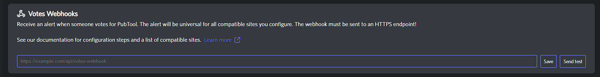
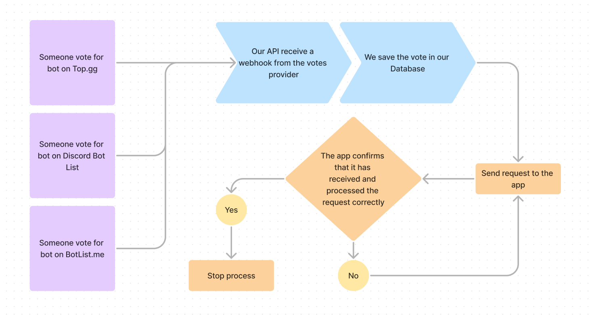

# Receive votes

## Beginners guide

### Before you begin

Before starting, you must meet the following prerequisites:

* Followed the tutorial [Votes Integration](../votes-integration.md)
* Have installed [NodeJS ](https://nodejs.org)(tested with 20.10.0 version)
* Have a [registered bot on Discord Analytics](../bot-registration.md)
* Have installed [Git CLI](https://git-scm.com/)

### Configuring your app

In first place, let's download our app sample. Open a terminal and enter

```bash
npx wrangler generate my-votes-webhook-app https://github.com/DiscordAnalytics/votes-webhook-example
```

Let's go in our directory:

```bash
cd my-votes-webhook-app
```

This app sample use NodeJS, so we need to install some dependencies:

```bash
npm install
```

Then, we need to open the index.js file in a texte editor like Notepad (Windows only):

```bash
nodepad index.js
```

Locate the following lines and update their values:

```javascript
const discordWebhook = "https://discord.com/api/webhooks/channelId/webhookToken"
const discordAnalyticsToken = "TOKEN"
```


Follow the [official Discord article](https://support.discord.com/hc/en-us/articles/228383668-Intro-to-Webhooks) if you don't know how to create a webhook.


Once you have completed this step, deploy your application using the following command:

```bash
npm run deploy
```

Log in to your Cloudflare account, then return to your terminal. Once the deployment is complete, retrieve the URL and open it in a browser to verify that the deployment was successful.

<figure><figcaption></figcaption></figure>

### Registering webhook on Discord Analytics

Login to Discord Analytics' dashboard and go to your bot's settings. Croll to the "Votes Webhook" section

<figure><figcaption></figcaption></figure>

Paste your URL in the field and add `/webhook` at the end.


Your URL should look like this: `https://<app_name>.<username>.workers.dev/webhook`.


Now you can save and send a test. If all is correctly configured, you should receive a message in your Discord channel. If not, repeat all the steps from the beginning.

## Webhooks reference

This section of the page is designed for advanced users who want to integrate the Discord Analytics webhook into a custom system.

### How does it work ?

<figure><figcaption><p>How does our API handle votes webhooks?</p></figcaption></figure>

When someone vote for your bot, the votes provider send us a request. Our API save the vote. Si ce bot a un webhook d'enregistré, l'API enverra une requête jusqu'à ce que l'app confirme l'avoir reçu.

### Handling a webhook

Firstly, your endpoint must use HTTPS. If you are a beginner, we recommend using [Cloudflare tunnels](https://developers.cloudflare.com/cloudflare-one/connections/connect-networks/get-started/) (requires full access to the host machine) or [Cloudflare Workers](https://workers.cloudflare.com/) (NodeJS, Rust, C and C++ only). Otherwise, you can set up a reverse proxy with the web server of your choice.

Next, your endpoint must return a 200 status code. Otherwise, the Discord Analytics API will retry the request after 10 seconds (after 15 failures, the request will not be retried).

Aside from these two constraints, you are free to do as you please, respecting our [Terms of Service](../../legals/terms.md).

### Request schema

To verify the origin of a webhook, our API adds your bot's Discord Analytics token to the `Authorization` header.

Here is a table listing each of the parameters included in the webhook body:&#x20;

<table><thead><tr><th width="164">Property</th><th width="284">Value type</th><th>Comment</th></tr></thead><tbody><tr><td><code>botId</code></td><td>String</td><td>The Discord ID of the bot</td></tr><tr><td><code>voterId</code></td><td>String</td><td>The Discord ID of the user who voted</td></tr><tr><td><code>provider</code></td><td><code>topgg</code> or <code>botlistme</code> or <code>dblist</code> or <code>test</code></td><td><code>test</code> will succeed if the request is for testing purposes.</td></tr><tr><td><code>date</code></td><td>String</td><td>The date of the vote</td></tr></tbody></table>

### Example request

```json
{
    "body": {
        "botId": "1082615775619199057",
        "voterId": "692374264476860507",
        "provider": "topgg",
        "date": "Sun Mar 24 2024 15:28:42 GMT+0100 (Central European Standard Time)"
    },
    "headers": {
        "Authorization": "32bacafb25269432562c8e32833e129d469fcd9d8a4678f6"
    }
}
```
