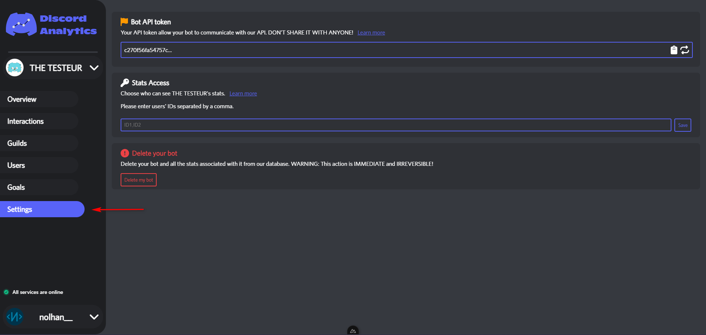

# Teams

## Introduction

Teams allow you to authorize anyone to access your robot. However, the teammates have access restrictions:

<table data-full-width="false"><thead><tr><th width="419">Permission</th><th>Allowed for teammates</th></tr></thead><tbody><tr><td>Get bot's informations</td><td>✅</td></tr><tr><td>Get &#x26; regen bot's token</td><td>❌</td></tr><tr><td>See bot's stats</td><td>✅</td></tr><tr><td>Edit team</td><td>❌</td></tr><tr><td>Delete bot</td><td>❌</td></tr></tbody></table>


All users you add must be registered on Discord Analytics.


## Edit teammates list

1. First, [copy the ID](https://support.discord.com/hc/en-us/articles/206346498-Where-can-I-find-my-User-Server-Message-ID-) of the user you want to give access to your bot.
2. Then, go to your bot's settings

<figure><figcaption></figcaption></figure>

3. Paste the ID in the "Stats Access" section. If you want to add more than one user, juste add comma between their ID!

<figure><figcaption></figcaption></figure>

4. Click on save and ask your friend to check the result!
