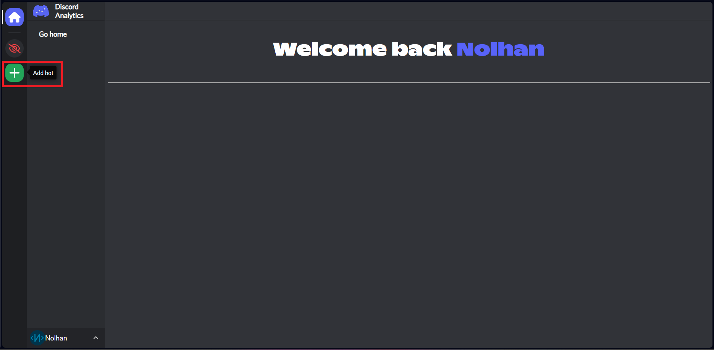
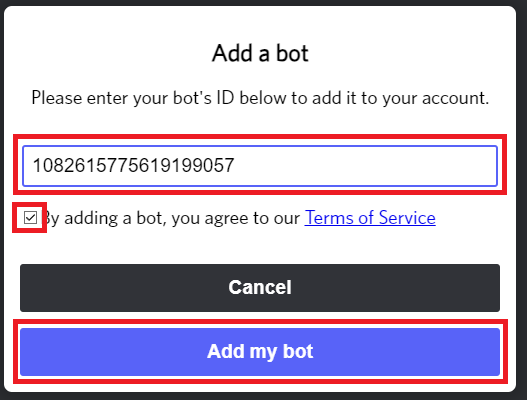
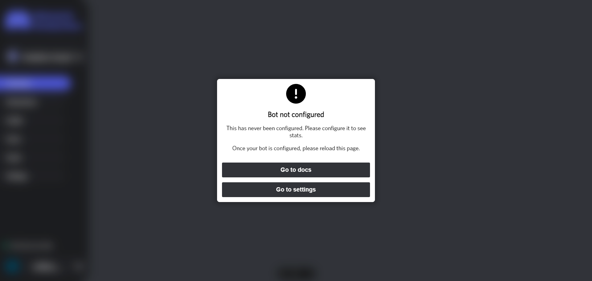
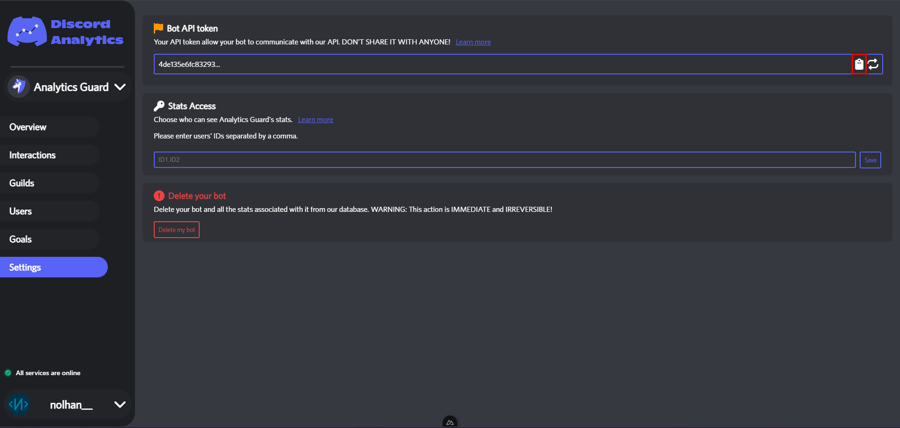

# Bot registration

1. [First, copy your bot's ID.](https://support.discord.com/hc/en-us/articles/206346498-Where-can-I-find-my-User-Server-Message-ID-)
2. Next, go to the dashboard and click on "add bot"

<figure><figcaption></figcaption></figure>

3. In the popup that appears, paste your bot's ID and accept the Terms of Use, then validate.

<figure><figcaption></figcaption></figure>

4. Once you have added your bot, you are redirected to this page :&#x20;

<figure><figcaption></figcaption></figure>

5. Click on "Go to settings" and copy your bot's token

<figure><figcaption></figcaption></figure>
