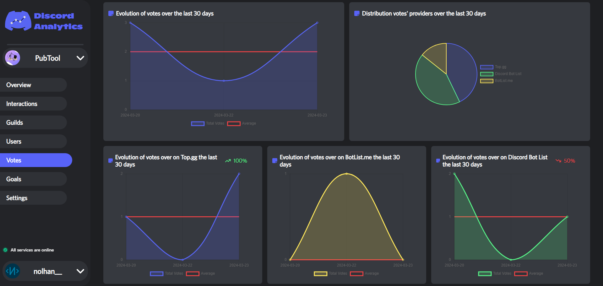
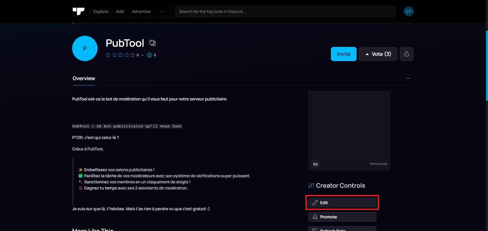
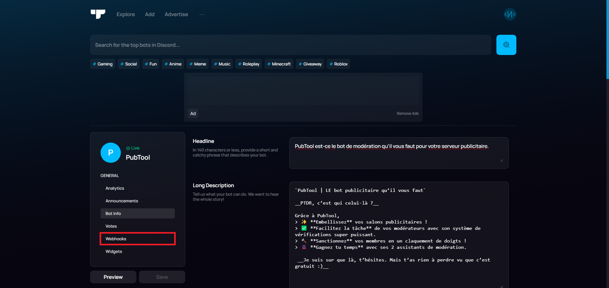
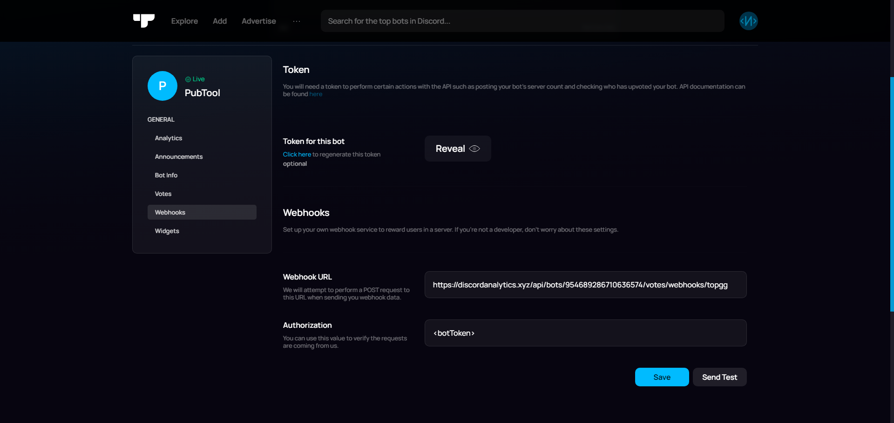
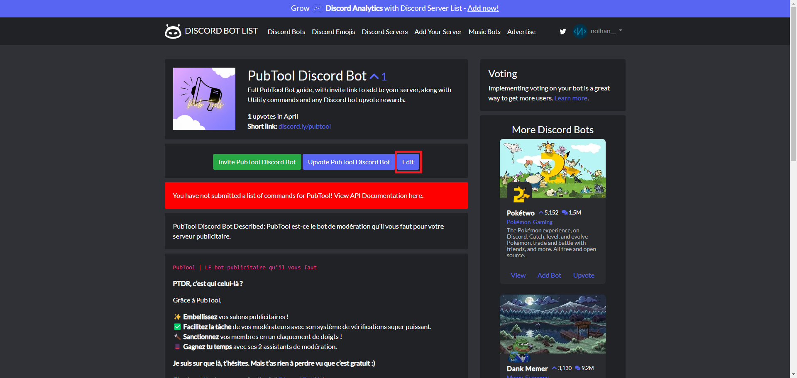
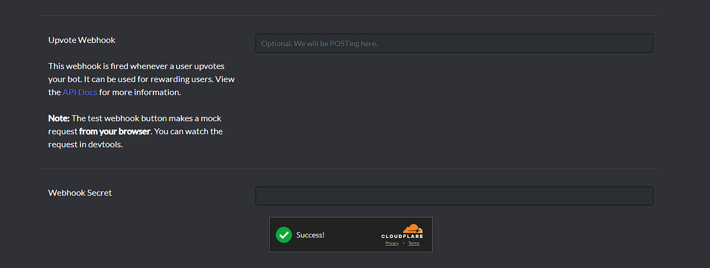
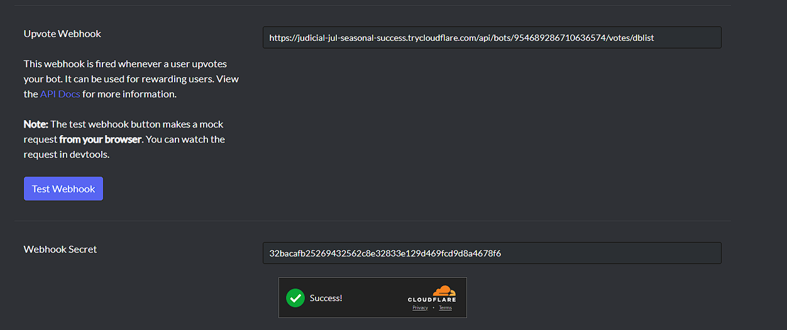

# Votes Integration

In this tutorial, we will learn how to connect a votes provider to Discord Analytics to receive statistics on the dashboard.

<figure><figcaption>
Votes page
</figcaption></figure>

## Compatibility

Discord Analytics is compatible with the following votes providers:

| Provider                                       | Compatibility status                 |
| ---------------------------------------------- | ------------------------------------ |
| [Top.gg](https://top.gg)                       | ✅Fully compatible                    |
| [BotList.me](https://botlist.me)               | 🏗️Compatible (but may contain bugs) |
| [Discord Bot List](https://discordbotlist.com) | ✅ Fully compatible                   |


Want more? Ask us on our [Discord Server](https://discordanalytics.xyz/go/support) ;)


## Configuration



1. Login on [top.gg](https://top.gg)
2. Go to your bot's page (`https://top.gg/bot/:your-bot-id`)
3. And click on "edit"

<figure><figcaption></figcaption></figure>

4. Go to "Webhooks" tab

<figure><figcaption></figcaption></figure>

5. Paste the following url in the "Webhook URL" field: `https://discordanalytics.xyz/api/bots/:your-bot-id/votes/webhooks/topgg` (Replace `:your-bot-id` with your bot's ID)
6. Paste your Discord Analytics token in the "Webhook Secret" field (See [how to get a token](bot-registration.md) for more informations)

<figure><figcaption></figcaption></figure>

7. Click on "Save" then "Send a Test". If everything is correct, you will receive a confirmation email.
8. Enjoy your stats :)



**Webhook endpoint:** `https://discordanalytics.xyz/api/bots/:your-bot-id/votes/webhooks/botlistme` (Replace `:your-bot-id` with your bot's ID)

**Webhook Secret:** your Discord Analytics token (See [how to get a token](bot-registration.md) for more informations)


We do not have a bot on BotList.me, which is why we are unable to provide you with a complete tutorial. If you are able to write it, we invite you to visit the GitHub repository of this documentation.

We apologize for the inconvenience caused.&#x20;






1. First, login on [Discord Bot List](https://discordbotlist.com)
2. Go to your bot's page (`https://`discordbotlist.com`/bots/:your-bot-id`)
3. Click on "Edit"

<figure><figcaption></figcaption></figure>

4. Scroll down to the "Upvote Webhook" section

<figure><figcaption></figcaption></figure>

5. Paste the following url in the "Webhook URL" field: `https://discordanalytics.xyz/api/bots/:your-bot-id/votes/webhooks/dblist` (Replace `:your-bot-id` with your bot's ID)
6. Paste your Discord Analytics token in the "Webhook Secret" field (See [how to get a token](bot-registration.md) for more informations)

<figure><figcaption></figcaption></figure>

7. Click on "Save" then "Test Webhook". If everything is correct, you will receive a confirmation email.
8. Enjoy your stats :)



## To Go Further

If you would like, you can receive a universal webhook for all the voting providers you have set up directly in your application! To do this, go to the following page:


[receive-votes.md](advanced-usage/receive-votes.md)

